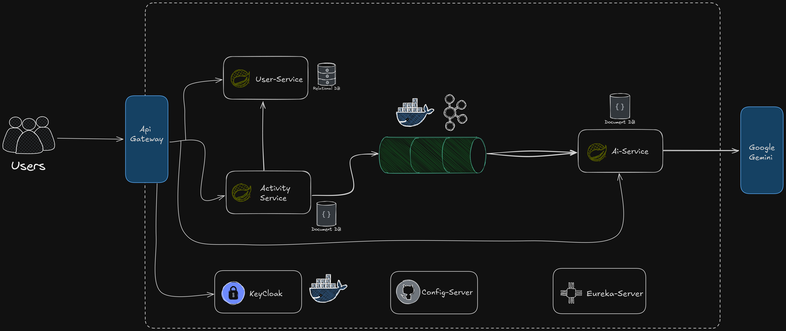

# FitOps AI Microservices



**FitOps AI Microservices** is a microservices-based Fitness Recommendation App that tracks user activities and provides personalized fitness recommendations using AI.

---

## Key Features

- **Microservices Architecture** for scalability and maintainability  
- **Real-time Messaging** with Kafka for activity data processing  
- **Secure Authentication** via Keycloak  
- **AI-Driven Insights** for personalized fitness recommendations  
- **Dockerized Services** for easy setup and deployment  

---

## Services Included

- User-Service  
- Activity-Service  
- AI-Service  
- API Gateway  
- Config Server  
- Eureka Server  

---

## Architecture

The system uses microservices communicating via REST and Kafka, with centralized authentication and service discovery. Check the architecture diagram above for a visual overview.

---

## Getting Started

1. Clone the repository:

   ```bash
   git clone https://github.com/sushantpaudel77/fitops-ai-microservices.git
Navigate to the project directory and start Docker containers:


docker-compose up -d
Access Keycloak at http://localhost:8181 and Kafka at localhost:9092.

License
This project is open-source under the MIT License.
